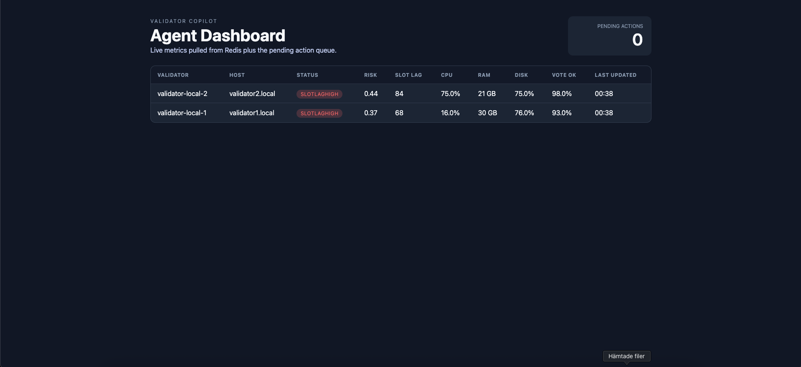

# Validate Agent

Validate Agent is a automates validator SRE. It continuously monitors validator metrics, detects unhealthy conditions and try to fix the problem to prevent down time.

## What’s in the box?

| Component | Path | Description |
| --- | --- | --- |
| Metrics Collector | `crates/metrics_collector` | Periodically writes synthetic Prometheus style metrics about each validator into Redis. |
| Agent | `crates/agent` | Reads metrics, detects issues, enqueues recovery actions, and exposes a small HTTP API + dashboard data feed. |
| Executor | `crates/executor` | Act on actions from Redis and run the associated remediation steps. |
| Shared types | `crates/common` | Validator config, metrics schema, action definitions, and helper utilities. |
| Dashboard | `dashboard/` | A simple dashboard that consumes the agent API and visualizes validators, risk scores, and pending actions. |
| Docker mocks | `docker/validator-mock` | Python service that serves `/metrics` endpoints for two fake validators. |

Redis acts as the central datastore and queue: metrics are written to `validator:metrics:<id>`, pending actions live in `actions:queue`, and historical results are pushed to `actions:history`.

## Prerequisites

- Docker Engine + Compose v2.20+ (for the full local stack)
- Rust 1.84+ if you plan to run binaries outside Docker
- Node 20+ (only needed if you want to run the dashboard locally; Docker handles it otherwise)

## Quick start

Bring up Redis, the Rust services, validator, and the dashboard via Docker:

```bash
cp config.docker.toml config.toml        # optional customization
docker compose up --build \
  agent metrics_collector executor \
  validator1 validator2 dashboard
```

You should now have:

- Agent API on http://localhost:3000 (health, metrics, JSON API)
- React dashboard on http://localhost:5173
- Validator mocks on http://localhost:9101/metrics and http://localhost:9102/metrics

The dashboard refreshes every few seconds by calling:

- `GET /api/validators` list of configured validators, latest metrics (if available), risk score, and derived status (`ok`, rule name, `no_data`, or `invalid_metrics`).
- `GET /api/actions` pending queue length

### Dashboard preview



## Working locally without Docker

1. Install toolchains:
   ```bash
   rustup default 1.84
   cargo install just   # optional helper
   ```
2. Start Redis (e.g. `brew services start redis`).
3. Copy `config.example.toml` → `config.toml` and update `redis_url` + validator hosts to match your environment.
4. Run each binary:
   ```bash
   cargo run -p metrics_collector
   cargo run -p agent
   cargo run -p executor --bin executor_daemon
   ```
5. For the dashboard:
   ```bash
   cd dashboard
   npm install
   VITE_AGENT_API=http://localhost:3000 npm run dev
   ```

## Running tests

The repo includes unit tests for each crate. Run everything (inside Docker to guarantee toolchain parity) with:

```bash
docker compose run --rm tests \
  sh -c "rustup component add rustfmt && cargo fmt && cargo test"
```

Or run locally if you already have Rust 1.84 installed:

```bash
cargo fmt
cargo test
```

## Repository layout

```
├── Cargo.toml                # Workspace definition + shared deps
├── config.example.toml       # Sample validator + Redis config
├── config.docker.toml        # Config wired to the Compose network
├── crates/
│   ├── agent/
│   ├── common/
│   ├── executor/
│   └── metrics_collector/
├── dashboard/                # React dashboard (Vite)
├── docker/                   # Entrypoint + validator mock server
├── docker-compose.yml
└── docs/
    └── docker.md             # Extended Docker + API notes
```

## Useful endpoints

| Path | Description |
| --- | --- |
| `GET /health` | Simple “ok” response for readiness probes. |
| `GET /api/actions` | pending count, future place for richer action stats. |
| `GET /api/validators` | Validator list including metrics, issue status, and risk score. |
| `GET /dashboard` | Dashboard for looking at current status of validator |